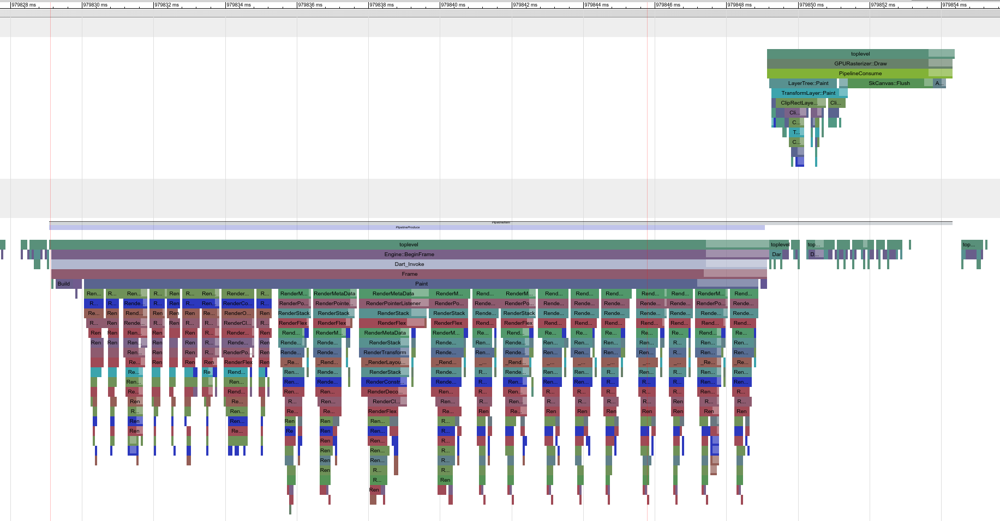
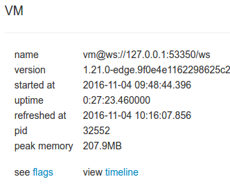
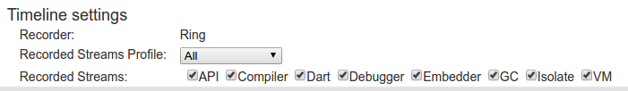
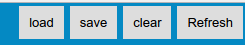

# Performance Optimizations

## How to see Performance Tracing

Want to see beautiful graphs like this that show what your app is building and
painting on every frame in the Dart Observatory like this?


1. Turn on profiling of builds and paints by setting `debugProfileBuildsEnabled` (from flutter/widgets.dart) and `debugProfilePaintsEnabled` (from flutter/rendering.dart) to `true`.<br/><br/>
**NOTE:** Doing this will only enable detailed profiling in debug builds.  If you want to see
the same details in a `flutter run --profile` build, apply [this patch](profiling.patch) to the flutter code you're using by running `git am --signoff < profiling.patch`

1. Launch your app via `flutter run --hot` or `flutter run --profile`

1. Upon running flutter you should see something similar to the following trace:
```
The Observatory debugger and profiler is available at: http://127.0.0.1:53350/
```
Go to that link in your browser.  This is the Dart Observatory for your flutter app.

1. On the middle left, click **view timeline**.


1. On the next page set **Recorded Streams Profile** to **All**


1. Now you're ready.  Click **clear** in the top right, do the thing you want to see the performance of in your flutter app, then click **Refresh**.


1. You'll now see a bunch of lines.  Navigate the chart like an FPS with **WASD**.  You'll likely need to pan over to where the action is then zoom in on it.

1. Once you're zoomed in, click on one of the solid colored boxes and press **G**.  Red lines will show the frame boundaries.  Your goal is to reduce all the build/layout/painting work done by flutter to happen in less width than the span between two red lines.

1. Profit!

---

## Build as little as possible
Building causes layout.  Layout causes painting.  Try to do as little rebuilding as possible.  Tricks for doing that are as follows:

1. Localize state changes to just rebuilding those widgets that need to change due to the state change.

1. If there is a large widget tree between where the state changes and where its used use [InheritedWidgets](https://docs.flutter.io/flutter/widgets/InheritedWidget-class.html) to pass that state down without requiring the entire tree to rebuild.  For examples of how we do this, explore [Model](../armadillo/lib/config_manager) and its subclasses and how they are used in [Armadillo](../armadillo/lib/armadillo).

---

## Reduce [Opacity](https://docs.flutter.io/flutter/widgets/Opacity-class.html) usage
Using [Opacity](https://docs.flutter.io/flutter/widgets/Opacity-class.html) requires the system to do something slow.  Things that can help with this:

1.  Move [Opacity](https://docs.flutter.io/flutter/widgets/Opacity-class.html) widgets as far down the tree as you can so they are covering the smallest
area possible.

1. If you're opacitizing a solid color image, use Image.color with [Color.withOpacity](https://docs.flutter.io/flutter/widgets/Color/withOpacity.html) to
set that image's opacity instead of using an [Opacity](https://docs.flutter.io/flutter/widgets/Opacity-class.html).

1. Similarly, if you're opacitizing any other widget with a solid color, using [Color.withOpacity](https://docs.flutter.io/flutter/widgets/Color/withOpacity.html) to set its color without using an [Opacity](https://docs.flutter.io/flutter/widgets/Opacity-class.html).

1. **WARNING!**  You can also use the [Color.withOpacity](https://docs.flutter.io/flutter/widgets/Color/withOpacity.html) trick with [Text.style](https://docs.flutter.io/flutter/material/Text/style.html).color but if you
are animating that opacity its cheaper to use an [Opacity](https://docs.flutter.io/flutter/widgets/Opacity-class.html) widget as relayouting text is expensive and changing a [Text.style's](https://docs.flutter.io/flutter/material/Text/style.html) color causes a relayout.

---

## Reduce Clipping
Try to reduce your use of [ClipRect](https://docs.flutter.io/flutter/material/ClipRect-class.html), [ClipRRect](https://docs.flutter.io/flutter/widgets/ClipRRect-class.html) and [ClipPath](https://docs.flutter.io/flutter/widgets/ClipPath-class.html) as much as possible.

Once option for rounded corners if your
background is a solid corner is using [RoundedCornerDecoration](../armadillo/lib/rounded_corner_decoration.dart) as a [Container.foregroundDecoration](https://docs.flutter.io/flutter/widgets/Container/foregroundDecoration.html).

---

## Try not to draw Paths
Just a curiousity I discovered in trying to implement [RoundedCornerDecoration](../armadillo/lib/rounded_corner_decoration.dart):  [Canvas.drawPath](https://docs.flutter.io/flutter/widgets/Canvas/drawPath.html) is much slower than [Canvas.drawDRRect](https://docs.flutter.io/flutter/widgets/Canvas/drawDRRect.html).

---

## Use [RepaintBoundary](https://docs.flutter.io/flutter/widgets/RepaintBoundary-class.html)
[RepaintBoundary](https://docs.flutter.io/flutter/widgets/RepaintBoundary-class.html) is useful to isolate
a parent from its animating children.  If you find more in your tree is being rebuilt and repainted than you expect try wrapping the changing child in a [RepaintBoundary](https://docs.flutter.io/flutter/widgets/RepaintBoundary-class.html).

---

## Be careful with [LayoutBuilder](https://docs.flutter.io/flutter/widgets/LayoutBuilder-class.html)
[LayoutBuilders](https://docs.flutter.io/flutter/widgets/LayoutBuilder-class.html) rebuild their
children in the following situations:

1. Their parent is rebuilt.

1. The constraints given to the [LayoutBuilder](https://docs.flutter.io/flutter/widgets/LayoutBuilder-class.html) change.

1. Their descendant rebuilds and the [LayoutBuilder](https://docs.flutter.io/flutter/widgets/LayoutBuilder-class.html) doesn't have tight constraints.

Of those three, the fact a descendant of the [LayoutBuilder](https://docs.flutter.io/flutter/widgets/LayoutBuilder-class.html) can cause the entire [LayoutBuilder](https://docs.flutter.io/flutter/widgets/LayoutBuilder-class.html) tree to be rebuilt is the most surprising.  To avoid this, ensure you are giving your [LayoutBuilder](https://docs.flutter.io/flutter/widgets/LayoutBuilder-class.html) tight constraints.
